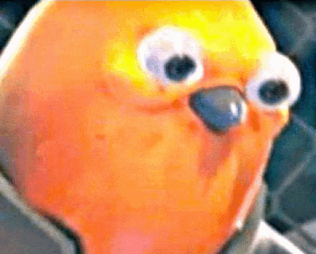

# My Music Streamer



<br>
<br>
<br>

- This is how I listen to music on my terminal. :)

<br>

1. Different from older release, the older release will be a different project in its own.

2. has `disown` ;)


<br>


## Requirements

- `yt-dlp`
- `mpv`
- `fzf`
- `socat`

## Usage

```bash
git clone https://github.com/hail0hydra/listen-here-you-little...

# make sure your `~/.local/bin` is in the PATH, just put it in your ~/.profile or ~/.zshrc or whatver shell you use
#
# export PATH="$HOME/.local/bin:$PATH"
#

cd listen-here-you-little...

# copy all the files: (play, pause, resume, next, prev) into the .local bin

cp next play pause resume $HOME/.local/bin  # make sure you do have $HOME/.local/bin 💫

#chmod all of them to give execute permissions

chmod +x $HOME/.local/bin/*
```

<br>
<br>


- play just like this:


```bash
# from youtube copy any video link

play <your-link>


# you can pause it.
pause


# if its a playlist, you can go to next
next

# lly go back
prev

# stop
stop
```

- beware `stop` and `pause` are not same

<br>
<br>
<br>


## Whyyyy?

- to do this

> unmute the video


https://github.com/user-attachments/assets/4f9ccade-31c5-4ba5-80c2-9e3396329a8c

<br>
<br>


## Head's Up
- I am using a profile in mpv config to save my settings. You can remove `--profile=your_profile_name` from the script if you want to use default settings.

- Here is what my profile looks like. You can customize it as you like.

```ini
# ~/.config/mpv/mpv.conf
[customsize]
geometry=800x600+100+100
fs=no
no-resume-playback
```

<br>
<br>
<br>

## Note
- This is a personal project. Feel free to modify it as you like.
- If you have any suggestions or improvements, please open an issue or a pull request.
- Enjoy your music! 🎵

<br>
<br>
<br>
